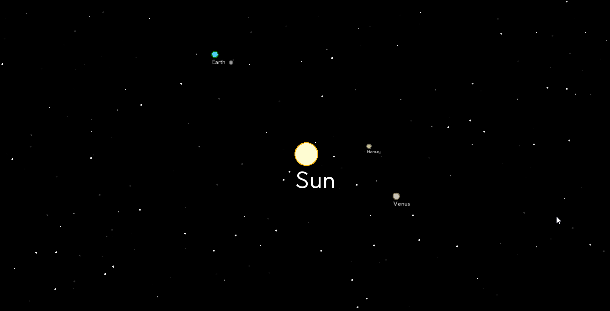

# The Solar System

2D модель солнечной системы. Итоговый проект для дисциплины "Объектно-ориентированное программирование".

## Возможности
* Отображение планет реальной солнечной системы
* Отображение лун некоторых планет
* Маштабирование, перемещение по карте (`ЛКМ + scroll`)
* Пауза симуляции (`space`)
* Отображение линий центров орбит (`T`)
* Подпись планет (`L`)

